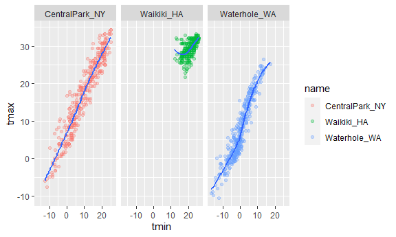
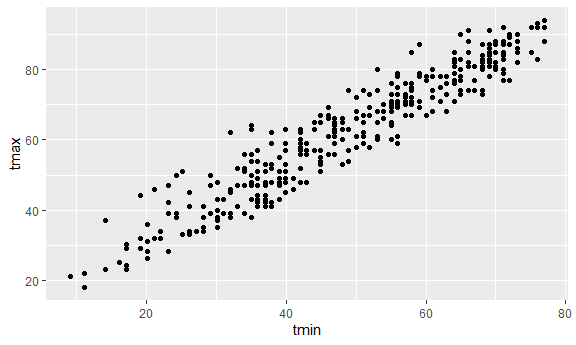

ggplot 1
================

``` r
library(tidyverse)
```

    ## -- Attaching packages --------------------------------------- tidyverse 1.3.1 --

    ## v ggplot2 3.3.5     v purrr   0.3.4
    ## v tibble  3.1.4     v dplyr   1.0.7
    ## v tidyr   1.1.3     v stringr 1.4.0
    ## v readr   2.0.1     v forcats 0.5.1

    ## -- Conflicts ------------------------------------------ tidyverse_conflicts() --
    ## x dplyr::filter() masks stats::filter()
    ## x dplyr::lag()    masks stats::lag()

``` r
library(ggridges)
```

## Load the weather data

``` r
weather_df = 
  rnoaa::meteo_pull_monitors(
    c("USW00094728", "USC00519397", "USS0023B17S"),
    var = c("PRCP", "TMIN", "TMAX"), #download from the internet
    date_min = "2017-01-01",
    date_max = "2017-12-31") %>%
  mutate(
    name = recode(
      id, 
      USW00094728 = "CentralPark_NY", 
      USC00519397 = "Waikiki_HA",
      USS0023B17S = "Waterhole_WA"),
    tmin = tmin / 10,
    tmax = tmax / 10) %>%
  select(name, id, everything())
```

    ## Registered S3 method overwritten by 'hoardr':
    ##   method           from
    ##   print.cache_info httr

    ## using cached file: C:\Users\Lenovo\AppData\Local/Cache/R/noaa_ghcnd/USW00094728.dly

    ## date created (size, mb): 2021-10-03 14:34:51 (7.614)

    ## file min/max dates: 1869-01-01 / 2021-09-30

    ## using cached file: C:\Users\Lenovo\AppData\Local/Cache/R/noaa_ghcnd/USC00519397.dly

    ## date created (size, mb): 2021-10-03 14:35:26 (1.701)

    ## file min/max dates: 1965-01-01 / 2020-02-29

    ## using cached file: C:\Users\Lenovo\AppData\Local/Cache/R/noaa_ghcnd/USS0023B17S.dly

    ## date created (size, mb): 2021-10-03 14:35:42 (0.913)

    ## file min/max dates: 1999-09-01 / 2021-09-30

``` r
weather_df
```

    ## # A tibble: 1,095 x 6
    ##    name           id          date        prcp  tmax  tmin
    ##    <chr>          <chr>       <date>     <dbl> <dbl> <dbl>
    ##  1 CentralPark_NY USW00094728 2017-01-01     0   8.9   4.4
    ##  2 CentralPark_NY USW00094728 2017-01-02    53   5     2.8
    ##  3 CentralPark_NY USW00094728 2017-01-03   147   6.1   3.9
    ##  4 CentralPark_NY USW00094728 2017-01-04     0  11.1   1.1
    ##  5 CentralPark_NY USW00094728 2017-01-05     0   1.1  -2.7
    ##  6 CentralPark_NY USW00094728 2017-01-06    13   0.6  -3.8
    ##  7 CentralPark_NY USW00094728 2017-01-07    81  -3.2  -6.6
    ##  8 CentralPark_NY USW00094728 2017-01-08     0  -3.8  -8.8
    ##  9 CentralPark_NY USW00094728 2017-01-09     0  -4.9  -9.9
    ## 10 CentralPark_NY USW00094728 2017-01-10     0   7.8  -6  
    ## # ... with 1,085 more rows

## Scatterplots

create my first scatterplot ever

``` r
ggplot(weather_df,aes(x = tmin, y = tmax)) +
  geom_point()
```

    ## Warning: Removed 15 rows containing missing values (geom_point).

<!-- -->

New approach, same plot

``` r
tail(weather_df)
```

    ## # A tibble: 6 x 6
    ##   name         id          date        prcp  tmax  tmin
    ##   <chr>        <chr>       <date>     <dbl> <dbl> <dbl>
    ## 1 Waterhole_WA USS0023B17S 2017-12-26     0  -2.5  -6.1
    ## 2 Waterhole_WA USS0023B17S 2017-12-27    25   0.1  -5  
    ## 3 Waterhole_WA USS0023B17S 2017-12-28    76   1.1  -0.3
    ## 4 Waterhole_WA USS0023B17S 2017-12-29   381   3.4  -2.1
    ## 5 Waterhole_WA USS0023B17S 2017-12-30    51  -1.1  -5.9
    ## 6 Waterhole_WA USS0023B17S 2017-12-31     0   0.7  -6.1

``` r
weather_df %>% #add sth like filter or mutate is ok
  ggplot(aes(x = tmin, y = tmax)) +
  geom_point()
```

    ## Warning: Removed 15 rows containing missing values (geom_point).

<!-- -->

\#\#Opyions to read\_csv

``` r
litters_df = read_csv("./data/FAS_litters.csv")
```

    ## Rows: 49 Columns: 8

    ## -- Column specification --------------------------------------------------------
    ## Delimiter: ","
    ## chr (2): Group, Litter Number
    ## dbl (6): GD0 weight, GD18 weight, GD of Birth, Pups born alive, Pups dead @ ...

    ## 
    ## i Use `spec()` to retrieve the full column specification for this data.
    ## i Specify the column types or set `show_col_types = FALSE` to quiet this message.

Save and edit a plot object

``` r
weather_plot = 
  weather_df %>% 
  ggplot(aes(x = tmin, y = tmax))#save the plot in the df

weather_plot = geom_point()
```

## Advanced scatterplot

Start with the same one and make it fancy

``` r
weather_df %>% 
  ggplot(aes(x = tmin, y = tmax, color = name)) +
  geom_point() +
  geom_smooth(se = FALSE)#se = limit
```

    ## `geom_smooth()` using method = 'loess' and formula 'y ~ x'

    ## Warning: Removed 15 rows containing non-finite values (stat_smooth).

    ## Warning: Removed 15 rows containing missing values (geom_point).

<!-- -->

What about the `aes` placement..?

``` r
weather_df %>% 
  ggplot(aes(x = tmin, y = tmax))
```

<!-- -->

``` r
  geom_point(aes(color = name))
```

    ## mapping: colour = ~name 
    ## geom_point: na.rm = FALSE
    ## stat_identity: na.rm = FALSE
    ## position_identity

``` r
  geom_smooth()#color only apply to point, and smooth will not get the color from point
```

    ## geom_smooth: na.rm = FALSE, orientation = NA, se = TRUE
    ## stat_smooth: na.rm = FALSE, orientation = NA, se = TRUE
    ## position_identity

Let’s facet somenthings!

``` r
weather_df %>% 
  ggplot(aes(x = tmin, y = tmax, color = name)) + 
  geom_point(alpha = .2,size = .3) +#size is the size of the points
  geom_smooth(se = FALSE) +
  facet_grid(. ~ name)#dot means don't create rows
```

    ## `geom_smooth()` using method = 'loess' and formula 'y ~ x'

    ## Warning: Removed 15 rows containing non-finite values (stat_smooth).

    ## Warning: Removed 15 rows containing missing values (geom_point).

<!-- -->

Let’s combine some elements and try a new plot

``` r
weather_df %>% 
  ggplot(aes(x = date, y = tmax, color = name)) +
  geom_point(aes(size = prcp), alpha = .5) + 
  geom_smooth(se = FALSE) +
  facet_grid(. ~ name)
```

    ## `geom_smooth()` using method = 'loess' and formula 'y ~ x'

    ## Warning: Removed 3 rows containing non-finite values (stat_smooth).

    ## Warning: Removed 3 rows containing missing values (geom_point).

<!-- -->

## somr small notes

How many geoms have to exist?

``` r
weather_df %>% 
  ggplot(aes(x = tmin, y = tmax, color = name)) +
  geom_smooth(se = FALSE)
```

    ## `geom_smooth()` using method = 'loess' and formula 'y ~ x'

    ## Warning: Removed 15 rows containing non-finite values (stat_smooth).

<!-- -->

You can use a neat geom!

``` r
weather_df %>% 
  ggplot(aes(x = tmin, y = tmax)) +
  geom_hex()
```

    ## Warning: Removed 15 rows containing non-finite values (stat_binhex).

<!-- -->

``` r
weather_df %>% 
  ggplot(aes(x = tmin, y = tmax)) +
  geom_density2d() +
  geom_point(alpha = .3)
```

    ## Warning: Removed 15 rows containing non-finite values (stat_density2d).

    ## Warning: Removed 15 rows containing missing values (geom_point).

<!-- -->

## Univariate plots(x and y are both varies)

Histograms are really great

``` r
weather_df %>% 
  ggplot(aes(x = tmin)) +
  geom_histogram()
```

    ## `stat_bin()` using `bins = 30`. Pick better value with `binwidth`.

    ## Warning: Removed 15 rows containing non-finite values (stat_bin).

<!-- -->

can we add color ..

``` r
weather_df %>% 
  ggplot(aes(x = tmin, fill = name)) +#color = color is only on the outline, fill = color also filled in
  geom_histogram(position = "dodge")
```

    ## `stat_bin()` using `bins = 30`. Pick better value with `binwidth`.

    ## Warning: Removed 15 rows containing non-finite values (stat_bin).

<!-- -->

``` r
weather_df %>% 
  ggplot(aes(x = tmin, fill = name)) +#color = color is only on the outline, fill = color also filled in
  geom_histogram()+
  facet_grid(. ~name)
```

    ## `stat_bin()` using `bins = 30`. Pick better value with `binwidth`.

    ## Warning: Removed 15 rows containing non-finite values (stat_bin).

<!-- -->

Let’s try a new geometry!

``` r
weather_df %>% 
  ggplot(aes(x = tmin, fill = name)) +
  geom_density(alpha = .3, adjust = .5)
```

    ## Warning: Removed 15 rows containing non-finite values (stat_density).

<!-- -->

What about box plots??

``` r
weather_df %>% 
  ggplot(aes(x = name, y = tmin)) +
  geom_boxplot()
```

    ## Warning: Removed 15 rows containing non-finite values (stat_boxplot).

<!-- -->

Trendy plots :-)

``` r
weather_df %>% 
  ggplot(aes(x = name, y = tmin, fill = name)) +
  geom_violin() + 
  stat_summary()
```

    ## Warning: Removed 15 rows containing non-finite values (stat_ydensity).

    ## Warning: Removed 15 rows containing non-finite values (stat_summary).

    ## No summary function supplied, defaulting to `mean_se()`

<!-- -->

Ridge plots – the most popular plot of 2017

``` r
weather_df %>% 
  ggplot(aes(x = tmin, y = name)) +
geom_density_ridges()
```

    ## Picking joint bandwidth of 1.67

    ## Warning: Removed 15 rows containing non-finite values (stat_density_ridges).

<!-- -->

## Save and Embed

Let’s save a scatterplot

``` r
weather_df %>% 
  ggplot(aes(x = tmin, y = tmax,color = name)) +
  geom_point(alpha = .5)
```

    ## Warning: Removed 15 rows containing missing values (geom_point).

<!-- -->

What about embedding…

``` r
weather_plot
```

    ## geom_point: na.rm = FALSE
    ## stat_identity: na.rm = FALSE
    ## position_identity

embed at different size

``` r
weather_plot
```

    ## geom_point: na.rm = FALSE
    ## stat_identity: na.rm = FALSE
    ## position_identity
